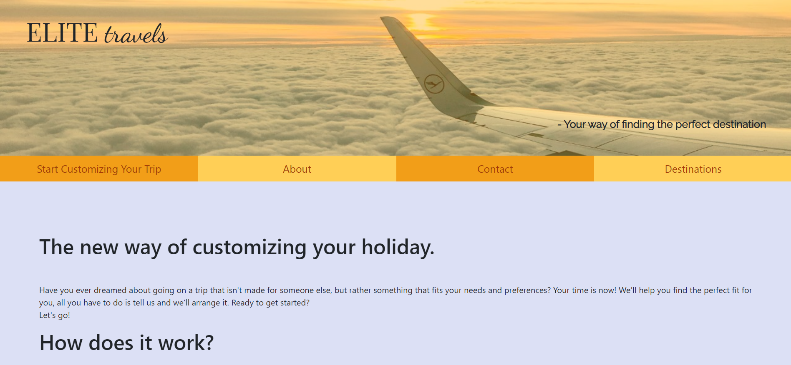

<h1 align="center">Elite Travels Webpage</h1>

[View the live project here.](https://matildamuyingo.github.io/MSP2/)

This webpage is made and designed for a company called Elite Travels and aims to help people customise their travel and finding an appropriate travel destination.

<h2 align="center"></h2>

## User Experience (UX)

-   ### User stories

    -   #### First Time Visitor Goals

        1. As a First Time Visitor, I want to easily understand the main purpose of the site and learn more about the services that are offered.
        2. As a First Time Visitor, I want to be able to easily navigate throughout the site and use the main function.
        3. As a First Time Visitor, I want to look for the best alternative for me and be able to find a price I can compare to other companies that offer similar services.

    -   #### Returning Visitor Goals

        1. As a Returning Visitor, I want to find information about how to get in contact with the company, for any questions I have.
        2. As a Returning Visitor, I want to be able to book a trip.
        3. As a Returning Visitor, I want to see if there are any updates to the destinations.

    -   #### Frequent User Goals
        1. As a Frequent User, I want to check if there has been any additions to the offered destinations.
       

-   ### Design
    -   #### Colour Scheme
        -   There are a few diferent colors used throughout the page. The four main colors are <span style="color:#F29E18"> Orange Web</span>, <span style="color:#A63C06">Rust</span>, <span style="color:#BBC6D3">Light Steel Blue</span> and <span style="color:#DCE0F5">Lavender Web</span>
    -   #### Typography
        -   At the top of the page we find a logo that consists of the fonts "Playfair Display" and "Dancing Script". At the bottom right of the hero image, a paragraph using the "Raleway" font can be found. The "Dancing Script" font can be found as heading for each of the destinations in the list further down on the page. The rest of the content uses the Bootstrap default font.
    -   #### Imagery
        -   The hero image at the top of the page has the intention of showing the user what the page is for, without them having to read any description. It is a picture that will clearly draw the mind to traveling, and captures interest without there being to much happening in the photo. The pictures used for the destinations have the purpose of showing a small view of what the scenery of the trip would look like.

*   ### Wireframes

    When making the wireframes, there was initially a few other ideas that was going to be in the project. This was tested out, but later changed and the wireframes were updated to change the page into something else. It went from being split into multiple pages, to being one longer page with the navigation sweeping down to the desired section.
    
    #### Initial Wireframes

    #### Updated Wireframes

    <span></span>
    <span></span>
    <span></span>


## Features

-   Responsive on all device sizes


## Technologies Used

### Languages Used

-   [HTML5](https://en.wikipedia.org/wiki/HTML5)
-   [CSS3](https://en.wikipedia.org/wiki/Cascading_Style_Sheets)
-   [JS](https://en.wikipedia.org/wiki/JavaScript) 

### Frameworks, Libraries & Programs Used

1. [Bootstrap 4.4.1:](https://getbootstrap.com/docs/4.4/getting-started/introduction/)
    - Bootstrap was used to assist with the responsiveness and styling of the website, but also to add the cards that are displayed when the options form have been filled out.
1. [Google Fonts:](https://fonts.google.com/)
    - Google fonts were used to import the 'Dancing Script' and 'Playfair Display' fonts into the style.css document.
1. [Font Awesome:](https://fontawesome.com/)
    - Font Awesome was used to add icons on the options-form and also at the bottom of the page, for the social media links.
1. [jQuery:](https://jquery.com/)
    - jQuery is used throughout the JavaScript files but was also required for a few Bootstrap elements.
1. [Git](https://git-scm.com/)
    - Git was used for version control by utilizing the Gitpod terminal to commit to Git and Push to GitHub.
1. [GitHub:](https://github.com/)
    - GitHub is used to store the projects code after being pushed from Git.
1. [EmailJS:](https://www.emailjs.com/)
    - EmailJS is used to send emails with the users questions or booking request that they've sent through the form at the bottom of the page.
1. [Google Maps:](https://developers.google.com/maps/documentation/javascript/overview)
    - The Google Maps API is used to load and display the maps for the destinations.


## Testing

The W3C Markup Validator and W3C CSS Validator Services were used to validate every page of the project to ensure there were no syntax errors in the project. The JSHint service was used to validate all JavaScript code used in the project.

#### HTML
-   [W3C Markup Validator](https://jigsaw.w3.org/css-validator/#validate_by_input) 
-    The Markup Validator found no errors or warnings.

#### CSS
-   [W3C CSS Validator](https://jigsaw.w3.org/css-validator/#validate_by_input)
-    The CSS Validator did not find any errors with the CSS code.

#### JavaScript
-   [JSHint](https://jshint.com/)
-    Each JS file passed the test on the JS Hint site without problems.

### Testing User Stories from User Experience (UX) Section


-   #### First Time Visitor Goals

    1. As a First Time Visitor, I want to easily understand the main purpose of the site and learn more about the services that are offered.

        1. When opening the site, the user sees the hero image, wich clearly illustrates that the page purpose is in regards to travelling.
        2. The start page always has the navigation bar and top of the about section visible, so the user can immidiatly find their way to getting more information about what the company does.
        3. The navigation bar indicates to the user that you can book trips and customize destinations, wich helps with understanding the purpose of the page.

    2. As a First Time Visitor, I want to be able to easily navigate throughout the site and use the main function.

        1. The user is greeted by the hero image and navigation bar. The navigation bar will immidiatly bring attention to the fact that you can customize your trip, and invites the user to click the link bringing them to that section.
        2. When going down to the customizing section, the user is encouraged to click the options for weather preferences, which will open the next step in the customisation.
        3. When the user submits the form, they are immidiatly brough to the results section where they get examples of trips that would fit. The user gets the options without having to navigate their way to finding them.

    3. As a First Time Visitor, I want to look for the best alternative for me and be able to find a price I can compare to other companies that offer similar services.
        
        1. After being presented with recommended options for travel destinations, there is a button that lets the user scroll down to a list with more destinations. Above the list is a promt to click the destinations for more information.
        2. On larger screens, a badge can be seen next to the name of the destination with the price for each person.
    

-   #### Returning Visitor Goals

    1. As a Returning Visitor, I want to find information about how to get in contact with the company, for any questions I have.

        1. The navigation bar has a contact/booking tab that will send the user to the bottom of the page where they can find an email form to send questions.
        2. The default form is for booking requests, and when clicking the button for "Contact", the button is highlighted to help the user see which one has been chosen.

    2. As a Returning Visitor, I want to be able to book a trip.

        1. As with the contact inquires, the navigation bar clearly helps the user to find the booking form.
        2. The booking form is pre-selected and all the user has to do is fill in the desired trip details, as well as contact information.

    3. As a Returning Visitor, I want to see if there are any updates to the destinations.
        1. As a returning visitor, the user can find their way down to the destinations list where information about the destinations can be found. 

-   #### Frequent User Goals

     1. As a Frequent User, I want to check if there has been any additions to the offered destinations.
        1. The frequent user would already be familiar with the page and look for changes in the destionations list, or get in contact through the contact form. 


    
### Further Testing

-   The Website was tested on Google Chrome, Microsoft Edge and Safari browsers.
-   The website was viewed on a variety of devices such as Laptop, iPhone7, iPhone XR & iPhone 11 Pro.
-   A large amount of testing was done to ensure that all pages were linking correctly.
-   Friends and family members were asked to review the site and documentation to point out any bugs and/or user experience issues. Feedback was gathered by using [Goolge-Forms](https://docs.google.com/forms/u/0/) and was then reviewed for changes. 

### Known Bugs

-   On some devices the maps have trouble loading if the conditions of the form displaying the options are changed.

## Deployment

### GitHub Pages

The project was deployed to GitHub Pages using the following steps...

1. Log in to GitHub and locate the [GitHub Repository](https://github.com/)
2. At the top of the Repository (not top of page), locate the "Settings" Button on the menu.
    - Alternatively Click [Here](https://raw.githubusercontent.com/) for a GIF demonstrating the process starting from Step 2.
3. Scroll down the Settings page until you locate the "GitHub Pages" Section.
4. Under "Source", click the dropdown called "None" and select "Master Branch".
5. The page will automatically refresh.
6. Scroll back down through the page to locate the now published site [link](https://github.com) in the "GitHub Pages" section.

### Forking the GitHub Repository

By forking the GitHub Repository we make a copy of the original repository on our GitHub account to view and/or make changes without affecting the original repository by using the following steps...

1. Log in to GitHub and locate the [GitHub Repository](https://github.com/)
2. At the top of the Repository (not top of page) just above the "Settings" Button on the menu, locate the "Fork" Button.
3. You should now have a copy of the original repository in your GitHub account.

### Making a Local Clone

1. Log in to GitHub and locate the [GitHub Repository](https://github.com/)
2. Under the repository name, click "Clone or download".
3. To clone the repository using HTTPS, under "Clone with HTTPS", copy the link.
4. Open Git Bash
5. Change the current working directory to the location where you want the cloned directory to be made.
6. Type `git clone`, and then paste the URL you copied in Step 3.

```
$ git clone https://github.com/YOUR-USERNAME/YOUR-REPOSITORY
```

7. Press Enter. Your local clone will be created.

```
$ git clone https://github.com/YOUR-USERNAME/YOUR-REPOSITORY
> Cloning into `CI-Clone`...
> remote: Counting objects: 10, done.
> remote: Compressing objects: 100% (8/8), done.
> remove: Total 10 (delta 1), reused 10 (delta 1)
> Unpacking objects: 100% (10/10), done.
```

Click [Here](https://help.github.com/en/github/creating-cloning-and-archiving-repositories/cloning-a-repository#cloning-a-repository-to-github-desktop) to retrieve pictures for some of the buttons and more detailed explanations of the above process.

## Credits

### Code

-   The function that makes the navigation bar scroll down to the desired sections was found on [JSFiddle](http://jsfiddle.net/BjpWB/4/)

-   The conditional form that is used for getting the destination options was found on [codepen.io](https://codepen.io/ErrorDactyl/pen/WrvOby) and was originally written by the user @ErrorDactyl. The forms content has been updated by the developer to fit the purpose, but the basic structure and functionality was used to achive this purpose.

-   [Bootstrap4](https://getbootstrap.com/docs/4.4/getting-started/introduction/): Bootstrap Library used throughout the project mainly to make site responsive using the Bootstrap Grid System and other components such as the cards displayed with the options.

-   [Google Maps](https://developers.google.com/maps/documentation/javascript/overview): The Google Maps was used to access maps and locations that are displayed in the results cards.


### Content

-   All content was written by the developer, **except for:**

    -   The two quotes that can be found at the top of the destinations section were found on [this page](https://expertvagabond.com/best-travel-quotes/)
    -   The promotional information that is in the paragraphs for each destination on the list, wich was found on [this page](https://www.holidayhypermarket.co.uk/hype/the-best-destinations-for-a-sun-soaked-shopping-holiday/)

### Media

-   All Images used were taken by the developer.

### Acknowledgements

-   My Mentor Arnold Kyeza for continuous helpful feedback and ideas for the website.

-   Friends and family for taking the time to test and review the webpage.